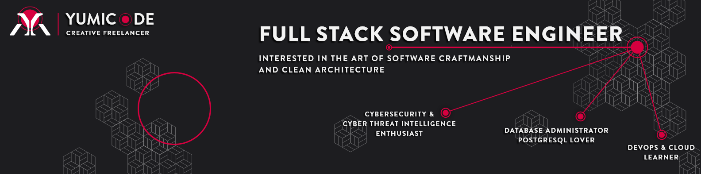
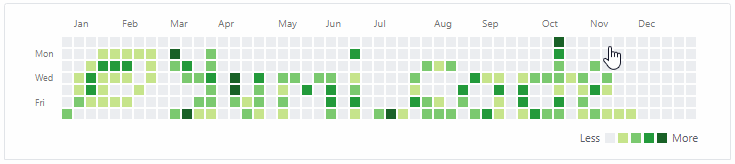

  
  
  
  

---

 

Fullstack Developer, experienced in both Front-end and Back-end development, my name is Helene and my friends call me Yumi. I'm from France living in Colmar 🇫🇷

I'm a passionate Software Developer & Database Administrator for PostgreSQL databases, working with a variety of technologies. From coding and deployment, to maintenance and updates. Using DevOps tools, I work hard to create clean architecture and clean code.

I'm smiling, I'm positive, super motivated, always willing to learn. I'm here to build positive relationships, find creative solutions to complex problems. I love pair programming and have a good team spirit.

Let's work together !

---

## 🍃 Streak stats

## 🐍 Contributions

---

Sources :

- [Badges](https://shields.io/category/build)
- [Contributions](https://github.com/DenverCoder1/github-readme-streak-stats)
- [Integrte snake animation](https://blog.arnabghosh.me/add-github-dark-snake-animation-readme)
