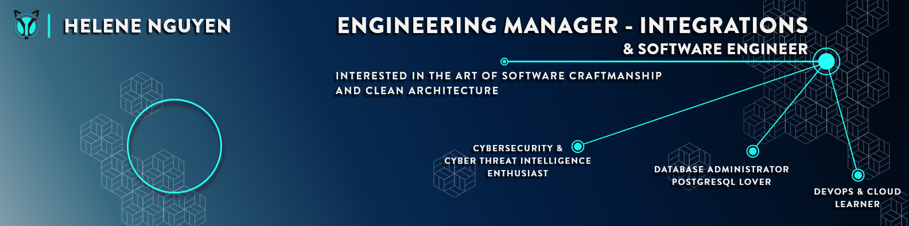
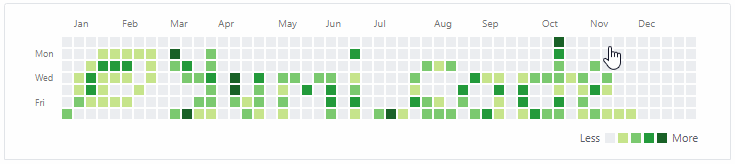

  
  

---

 

Engineering Manager in CyberSecurity field, experienced in building, optimizing, and maintaining the Integrations for CyberThreat Intelligence platform OpenCTI, building robusts connectors, extensible integration architecture capable of supporting hundreds of data.

I'm from France living in Colmar 🇫🇷.

I'm a passionate Software Developer. From coding and deployment, to maintenance and updates. Using DevOps tools, I work hard to create clean architecture and clean code.

I love open source projects. When an open-source application meets an open-source tool, it unlocks the full power of open collaboration and innovation!

I'm smiling, I'm positive, super motivated, always willing to learn. I'm here to build positive relationships, find creative solutions to complex problems. I love pair programming and have a good team spirit.

---

## 🍃 Streak stats

## 🐍 Contributions

---

Sources :

- [Badges](https://shields.io/category/build)
- [Contributions](https://github.com/DenverCoder1/github-readme-streak-stats)
